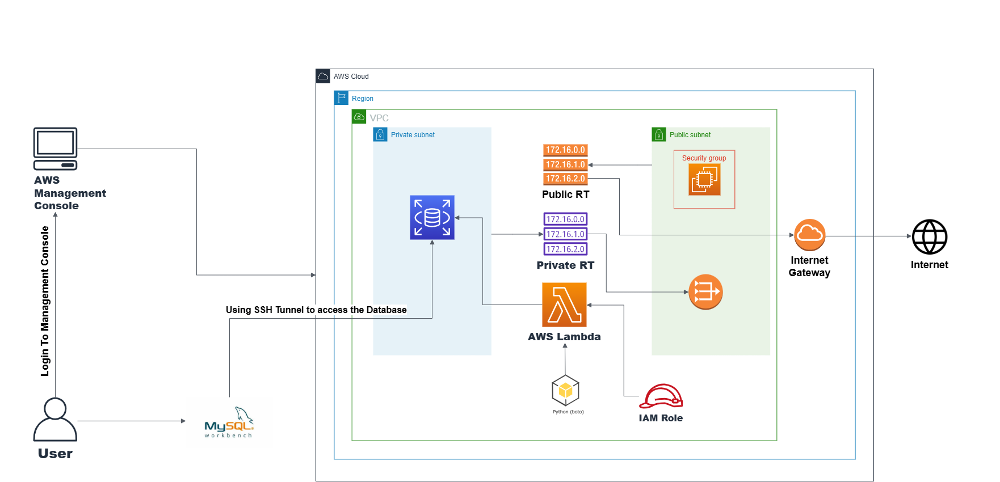

# Secure AWS RDS Deployment with Lambda & MySQL Workbench

This project demonstrates how to **securely deploy an AWS RDS (MySQL) instance within a VPC**, connect it using **AWS Lambda**, and access the database via **MySQL Workbench** through an **EC2 bastion host** and SSH tunneling. It follows best practices in **cloud architecture and protocols**.

---

## Table of Contents
- [Architecture](#architecture)
- [Tech Stack](#tech-stack)
- [Features](#features)
- [Deployment Steps](#deployment-steps)
- [MySQL Workbench SSH Tunnel](#mysql-workbench-ssh-tunnel)
- [Lambda Function](#lambda-function)
- [Project Structure](#project-structure)
- [Learnings](#learnings)
- [License](#license)

---

## Architecture



> A custom VPC with public and private subnets is used to isolate components. The RDS MySQL database is deployed privately and accessed securely via a Lambda function and bastion host.

---

## Tech Stack

- **AWS RDS (MySQL)** — Relational database backend
- **AWS Lambda (Python)** — Serverless access to RDS
- **Amazon VPC** — Isolated network environment
- **EC2 Bastion Host** — Secure tunneling
- **MySQL Workbench** — GUI client for MySQL
- **IAM Roles & Security Groups** — Controlled access

---

## Features

- Secure deployment using **private subnets** and **NAT Gateway**
- AWS Lambda connection to RDS with **IAM roles**
- Bastion host-based **SSH tunneling**
- MySQL Workbench access without exposing RDS publicly
- Fully scripted and documented deployment process

---

## Deployment Steps

Complete steps are in [`deployment/step-by-step-deployment.md`](deployment/step-by-step-deployment.md)

1. Create a VPC with 1 public and 1 private subnet
2. Set up an Internet Gateway and NAT Gateway
3. Create and associate route tables
4. Launch an EC2 Bastion Host in the public subnet
5. Create a **private RDS MySQL instance**
6. Deploy a Lambda function with VPC access
7. Create a security group (`SG-RDS`) for all services
8. Configure SSH tunneling to access RDS from MySQL Workbench

---

## MySQL Workbench SSH Tunnel

Detailed instructions in [`deployment/ssh-tunnel-setup.md`](deployment/ssh-tunnel-setup.md)

Use this command:

```bash
ssh -i your-key.pem -L 3307:<rds-endpoint>:3306 ec2-user@<ec2-public-ip>
```
---

## MySQL Workbench Configuration

Once your SSH tunnel is active, open **MySQL Workbench** and set the following:

- **SSH Hostname**: `<EC2 public IP>`
- **SSH Username**: `ec2-user`
- **SSH Key File**: Path to your `.pem` key
- **MySQL Hostname**: `<RDS endpoint>`
- **Port**: `3306`
- **MySQL Username/Password**: As configured in your RDS instance

---

## Lambda Function

The Lambda function connects to your RDS instance and inserts data using the `pymysql` library.

```python
import pymysql

def lambda_handler(event, context):
    conn = pymysql.connect(
        host='your-rds-endpoint',
        user='your-username',
        password='your-password',
        database='student_db'
    )
    cursor = conn.cursor()
    query = "INSERT INTO student_table (PRN, Name, Department) VALUES (%s, %s, %s)"
    values = ('2022', 'Pratik Tangadpalliwar', 'Cloud & System Admin')
    cursor.execute(query, values)
    conn.commit()
    conn.close()
    return {"status": "Success"}
```
> Lambda setup steps and IAM permissions are detailed in deployment/step-by-step-deployment.md
---

## Project Structure
```
aws-rds-lambda-secure-setup/
├── architecture/
│ └── aws-rds-lambda-architecture.png
├── deployment/
│ ├── step-by-step-deployment.md
│ ├── ssh-tunnel-setup.md
│ └── aws-cli-commands.txt
├── lambda_code/
│ └── insert_data.py
├── database/
│ ├── schema.sql
│ └── init_data.sql
├── screenshots/
│ └──Lambda-function.png
│ └──RDS-instance.png
│ └──Screenshot 2025-06-14 121337.png
│ └──Screenshot 2025-06-14 121356.png
│ └──Screenshot 2025-06-14 121406.png
│ └──VPC-setup.png
│ └──insert-result1.png
│ └──insert-result2.png
├── License
└── README.md

```
---

## Learnings

- Deep understanding of **VPC architecture**
- How to secure **RDS access using private subnets**
- Integration of **AWS Lambda with RDS (MySQL)**
- Use of **SSH tunneling** to access private database instances
- Proper configuration of **IAM roles**, **security groups**, and **subnet routing**
---
